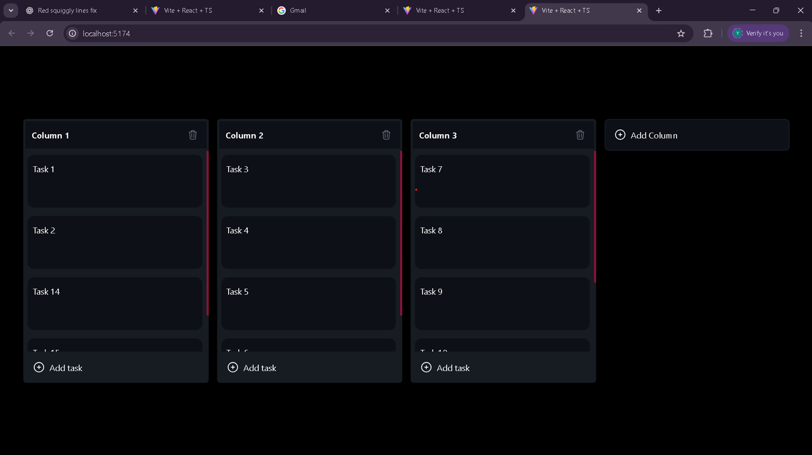

# Kanban Board Project


A simple **Kanban board** built with **React, TypeScript, Tailwind CSS, and dnd-kit** (drag & drop).

---

## 🚀 Features

* Create and delete columns
* Add and remove tasks
* Drag & drop columns and tasks
* Clean, responsive UI with Tailwind CSS

---

## 🧰 Tech Stack

* React + TypeScript
* Vite
* Tailwind CSS
* dnd-kit

---

## ✅ Prerequisites

* **Node.js** 18 or newer
* **npm** (comes with Node)

Check versions:

```bash
node -v
npm -v
```

---

## 🛠️ Run Locally

1. **Clone the repository**

   ```bash
   git clone https://github.com/yashb-16/Kanban-board-project.git
   ```
2. **Go into the project directory**

   ```bash
   cd Kanban-board-project
   ```
3. **Install dependencies**

   ```bash
   npm install
   ```
4. **Start the dev server**

   ```bash
   npm run dev
   ```
5. Open the Local URL shown in the terminal (usually `http://localhost:5174/`).

---

## 📦 Available Scripts

* **`npm run dev`** – start Vite dev server
* **`npm run build`** – production build
* **`npm run preview`** – preview the production build locally

---

## 🗂️ Project Structure (brief)

```
src/
  components/
    ColumnContainer.tsx
    KanbanBoard.tsx
    TaskCard.tsx
  icons/
  index.css
  main.tsx
  App.tsx
```

---

## 📸 Screenshot 



---

## Live Demo  

Check out the live demo here 👉 [Kanban Board (Live)](https://kanban-board-project-beta.vercel.app/)

---

## 🙌 Author

**Yash Bansal**
GitHub: [@yashb-16](https://github.com/yashb-16)
